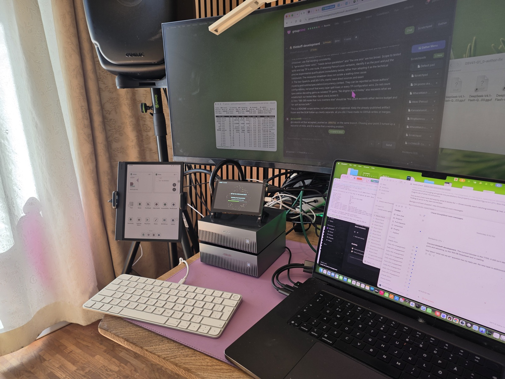
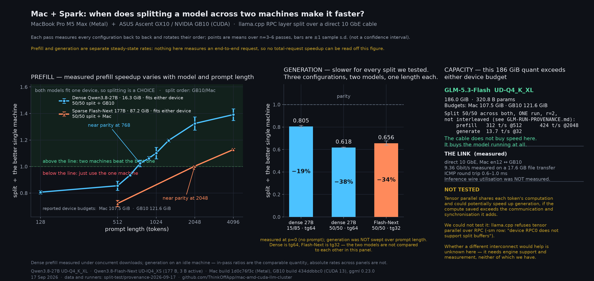

# mac-amd-cuda-llm-cluster

Run a 321B model across a Mac and an AMD Strix Halo mini PC over one Thunderbolt
cable, with an NVIDIA GB10 on the same bench. Benchmark results are labelled
with their configurations. Now building tensor parallelism across Metal, ROCm
and CUDA, aiming to speed up both prompt processing and output generation.

### Development update — 17 September 2026

We are now developing **Mac + AMD + CUDA tensor parallelism**, beginning with
Mac correctness tests and AMD support alongside them. This is separate from
the existing llama.cpp RPC benchmarks below. The performance target is both
prefill and generation faster than the fastest single host under matched
model, precision, context and workload; we have not demonstrated that target.

- **Implemented and locally tested:** a [sharded FP32 MLP harness](prototypes/heterogeneous-tp/README.md)
  with local MPS/CUDA/ROCm device selection and explicit CPU-staged Gloo
  collectives. Two local MPS ranks on one Mac passed at 1, 17 and 128 tokens
  against an unsharded CPU reference (maximum absolute error `9.54e-7`).
  The two-rank CPU control also passed. These are two processes on one machine,
  not a successful cross-host GPU test or a speed benchmark.
- **First Mini–AMD attempt:** initialization failed before GPU computation,
  with a Gloo UV address-size mismatch (`136 vs 177`), using Mini PyTorch
  2.11.0 and AMD PyTorch 2.12.0a0. PyTorch's platform defaults select different
  Gloo transports. Transport availability and wire compatibility must be
  checked in the actual builds; this is not proof that every Mac–Linux Gloo
  configuration is impossible. See the [upstream device factory](https://github.com/pytorch/pytorch/blob/v2.11.0/torch/csrc/distributed/c10d/GlooDeviceFactory.cpp).
- **Portable transport investigation:** the Helsinki team reports a working
  two-host CPU socket reduction probe. Its raw results and framing need review
  before inclusion as benchmark data. This does not yet validate an integrated
  MPS–ROCm model run, accelerator transfer costs, or negligible transport overhead.
- **Spark–Spark control:** the MiaLab GLM-5.3-Flash EXL3/DFlash recipe has been
  attempted. The latest diagnosed failure was worker-side DFlash weight loading;
  the worker exited while the head container remained running without a healthy
  API. Repair/relaunch is underway. No successful served-token result from this
  recipe is recorded here yet.

Next gates are a physical mixed-host correctness run, a transformer block,
a small complete model, then repeatable end-to-end timing. Experimental RDMA
drivers and hardware compatibility are separate work; they are not prerequisites
for the first correctness gate.

Everyone pairs DGX Sparks with DGX Sparks, or Macs with Macs. This repo
documents the mixed set: **Apple M5 Max (Metal) + AMD Strix Halo (ROCm) +
NVIDIA GB10 (CUDA)**, joined by `ggml-rpc-server` over a Thunderbolt IP link
and 10 GbE. It is the setup behind the M5² benchmark card.

All three backends now appear here, which is why the repo is no longer called
`mac-amd-llm-cluster`. The GB10 first appears below as a straight two-way comparison on
identical files, and then split across the cable with the Mac: when that split is worth
doing, when it is not, and the 186 GiB quant that exceeds either device budget and ran split
across both.

## What we are aiming at

Build and measure a heterogeneous **Apple Metal + AMD ROCm + NVIDIA CUDA** execution framework
that, for a matched model, quantization and workload:

1. **beats the fastest single host** in both prefill and generation, then
2. **beats the fastest-plus-slowest two-host pair** in both.

Neither is achieved. Neither has even been attempted yet, and the distinction that makes that true
is worth stating plainly: **three hosts is not three platforms.** A MacBook and two GB10 Sparks is
three machines but only two backends, Metal and CUDA. The AMD Strix Halo sits at the other desk, so
every result below is a two-platform result.

Where the two-platform work stands, as context rather than as partial credit:

- **Prefill** already beats the better single machine past a crossover, from about 896 prompt tokens
  on the dense 27B and about 4096 on the sparse 177B, with the margin still growing at the longest
  length tested.
- **Generation** has lost every split we have tried, by roughly a third at best. That is the real
  work, and adding a third platform does not by itself fix it.

Milestone 2 is the one that matters for a mixed set: it asks whether a slower third platform still
*adds* once you have the good pair, rather than being carried by it. If it does not, the honest
result is that heterogeneous scaling stops at two, and that is worth publishing too.

Every table below is what the hardware actually did, including the configurations where combining
machines made things worse.

### Two desks, two halves of this repo

**Helsinki — the Thunderbolt pair.** Bosgame M5 (Strix Halo, ROCm) and the MacBook, joined by one
Thunderbolt cable. This is the rig behind the M5² card and every ROCm row below.


**Berlin — the CUDA half.** Two ASUS Ascent GX10 (NVIDIA GB10) stacked beside the same MacBook,
which is where every GB10 number on this page was measured, with the 200 GbE DAC between them and
the 10 GbE cable to the Mac.

Both boxes are visible in the fleet view on the screen behind, `gx10-6678` and `gx10-e6a8`, each
reporting CPU, memory and its **own** critical temperature rather than a guessed scale: 49.1 °C and
46.8 °C against the 104.8 °C every ACPI zone on a GX10 declares, beside the Strix Halo box at 73 °C
against its 110. The 5-inch panel on top is the Sparks' console, the e-ink tablet on the left is the
same fleet on a phone-class screen.



Three links, all measured:

| link | what it carries | measured |
|---|---|---|
| **Thunderbolt** | MacBook ↔ Strix Halo, Helsinki | see the M5² table |
| **10 GbE** | MacBook ↔ Spark 1, direct cable | **8.7 Gbit/s** by file transfer; every GB10 split number on this page crossed it |
| **200 GbE** | Spark 1 ↔ Spark 2, one QSFP56 DAC | **185 Gbit/s** RDMA write, 93 % of line rate |

**The 200 GbE figure has a trap in it.** A single RDMA stream reaches 108.33 Gbit/s, about half the
port, and stays there. The full 185 only appears when **both PCIe functions of that one port are
driven at once** — 92.56 Gbit/s each, concurrently. Configure one interface, measure it, and you
will conclude the cable does 108 and move on, which is why NVIDIA's playbook has you address every
interface of a populated port rather than one.

```
ib_write_bw -d rocep1s0f0   -F --report_gbits -D 10                      108.33  (x2 passes)
ib_write_bw -d rocep1s0f0   -p 18515  +  -d roceP2p1s0f0 -p 18516        92.56 + 92.56  (x2 passes)
```

ConnectX-7, firmware 28.45.4028 both ends, MTU 1500, `Link type: Ethernet`, `GID index: 5` — the
RoCEv2 entry carrying the IPv4-mapped fabric address on `enp1s0f0np0` at each end, so the device and
GID selection is checkable rather than asserted. `BW peak` reads 0.00 in duration mode, so only the
average is a real number.

Complete per-process stdout and stderr, with the exact command and timestamps in every header, and
the full GID tables from both boxes:
[`benchmarks/roce-2026-09-17/raw/`](benchmarks/roce-2026-09-17/raw/). The concurrent configuration
was run twice, independently, and agreed. Failed capture attempts are kept in that directory as
empty files rather than deleted.

This is RDMA write bandwidth between two idle machines, **not** what an inference run achieves over
the same wire. NCCL will be lower, and that is the figure that matters for a model split across both
Sparks. It has not been measured yet.

**One thing the photo makes easy to misread:** each Spark shows *two* 200 GbE interfaces
(`enp1s0f0np0` and `enP2p1s0f0np0`), and that is one physical QSFP port presented as two PCIe
functions, not two cables. NVIDIA states it plainly — "Each QSFP port appears as two independent
Linux Ethernet interfaces". There is exactly one cable between the boxes.


**Companion repo:** [StrixLink](https://github.com/ThinkOffApp/StrixLink) is the cable underneath
this one — what a Thunderbolt link between a Mac and a Strix Halo box can actually carry, measured
layer by layer, plus the raw logs behind every table here.


## The measured result (GLM-5.3-Flash 321B MoE, pp512 / tg128 tok/s)


Every cell remeasured on 10-11 Sep 2026 on one llama.cpp commit (upstream PR 27754,
`d94f44e79`) with the Strix at the 1 GB VRAM carve-out; every cell answered the same
prompt correctly at temperature 0. The August numbers stay in brackets.

| quant | size | MacBook solo | Strix solo | split, best placement (Strix / Mac share) | split, llama.cpp default placement |
|---|---:|---:|---:|---:|---:|
| IQ1_S 1.6-bit | 93 GB | 491 / 30.6 (Aug 456 / 29.4) | 117 / 15.1 (Aug 72 / 6.2) | **333 / 24.2** (15 / 85) | 188 / 17.1 (Aug 177 / 18.4) |
| IQ2_XXS 2-bit | 102 GB | 491 / 31.7 (Aug 483 / 26.3) | 115 / 14.8 (Aug 68 / 5.8) | **330 / 24.3** (15 / 85) | 186 / 16.8 (Aug 169 / 17.2) |
| Q3_K_XL 3-bit | 148 GB | thrashes | won't fit | **184 / 13.8** (45 / 55) | 172 / 12.9 (Aug 160 / 15.5) |
| IQ4_XS 4-bit | 157 GB | thrashes | won't fit | **197 / 15.2** (37 / 63) | 166 / 12.4 (Aug 161 / 15.6) |
| Q4_K_XL 4.5-bit | 200 GB | won't fit | won't fit | too big to move Mac-heavy under the two ceilings | **162 / 11.9** (Aug 80 / 9.9) |

**What the rerun found.** Two things moved, neither of them hardware.

1. *The Strix solo column was the code, not the memory.* August's own binary gives the
   same ~8.7 tok/s at either carve-out; the 3 September GLM branch gives 12.2, and PR
   27754's Vulkan kernels for the fused hyper-connection ops give 15.1. The BIOS change
   (64 GB carve to 1 GB, one contiguous ~120 GB GPU region) is what lets the 93-102 GB
   files sit on the GPU at all; the speed came from upstream.
2. *The split column was placement.* llama.cpp's default tensor split hands about half the
   layers to the slower box, so the pair was barely faster than August. Putting 85 % of the
   two small files on the Mac (`-ts 15/85`, the RPC device's share comes first) nearly
   doubled prompt speed and lifted generation by a third, on the same two boxes and cable.
   The big files sit where the two ceilings allow: about 110 GB usable on the Strix GPU
   (the 122 GB box hard-hangs above that), about 90 GB of weights on the Mac's Metal
   before it answers "Insufficient Memory" (`iogpu.wired_limit_mb` at its default). Q4_K_XL
   at 200 GB cannot be concentrated on either side, so it keeps the default placement.

The split is still not free speed: when a model fits one machine, solo wins (491 vs 333 pp).
The cable buys **existence** for models past your RAM line: the 200 GB row runs nowhere else.
Raw llama-bench output, the buffer-size lines and the two rows we do not publish (an
M5-heavy slip and the Mac-OOM void) are in
[ThinkOffApp/StrixLink docs/raw-2026-09-11](https://github.com/ThinkOffApp/StrixLink/tree/main/docs/raw-2026-09-11).

The August card, for the record: [benchmarks/m5squared-card.png](benchmarks/m5squared-card.png).

## A third backend: NVIDIA GB10 vs Apple Metal (16-17 Sep 2026)

An ASUS Ascent GX10 (**NVIDIA GB10**, compute capability 12.1, 124,544 MiB, CUDA 13)
joined the bench over 10 GbE. The same GGUF file was copied to both machines and run with the same `llama-bench` flags,
so there are no quant or model differences between the columns. Two things do still differ
besides the silicon: the backend (Metal vs CUDA) and the llama.cpp build, which is six days
apart (Mac `1d0c76f3c`, GB10 `434ddbbc0`, same ggml 0.23.0). Read the columns as
"this file on this machine's stack", not as a pure silicon comparison.

**Dense — Qwen3.8-27B UD-Q4_K_XL, 16.34 GiB, 27.32 B params**

| test | Mac M5 Max (Metal) | GB10 (CUDA) | winner |
|---|---:|---:|---|
| pp512 | 715.06 | **849.32** | GB10 ×1.19 |
| pp2048 | 648.40 | **858.37** | GB10 ×1.32 |
| tg64 | **25.10** | 12.84 | Mac ×1.95 |

**Sparse — Qwen3.6-35B-A3B UD-Q3_K_S, 14.29 GiB, 34.66 B total / 3 B active**

| test | Mac M5 Max (Metal) | GB10 (CUDA) | winner |
|---|---:|---:|---|
| pp512 | **3240.20** | 2439.58 | Mac ×1.33 |
| pp2048 | **3080.27** | 2455.70 | Mac ×1.25 |
| tg64 | **97.67** | 68.37 | Mac ×1.43 |

**On these two models, the GB10's prefill lead appears on the dense one and reverses on the
sparse one.** On the dense 27B the GB10 prefills 1.32× faster while the Mac generates nearly
twice as fast — the familiar compute-versus-bandwidth split, and the reason a prefill-there /
generate-here arrangement looks attractive. On the sparse 35B-A3B, a *larger* model by total
parameters, the Mac wins both halves.

Two configurations are not a law. What we have is one dense pair and one sparse pair, on one
quant each, on two llama.cpp builds. The obvious *hypothesis* is that with 3 B of 34.66 B
parameters active, prefill stops being dominated by dense matmul and becomes routing and
gather work, which would favour unified memory — but nothing here measures that mechanism,
and we have not varied sparsity, quant or build independently.

Why it still matters for this repo: the models we are aiming at in the 100 GB class are all
MoE — GLM-5.3-Flash, DeepSeek V4.1, Qwen3.8-Flash-Next (512 experts, 10 active). If the
reversal holds for them, the GB10 is the slower box at both halves for exactly the workloads
this repo exists to run. That is the next measurement, not a conclusion.

**The reversal does hold at the 100 GB class (measured 17 Sep 02:47).** The open question above is
now answered for the size this repo actually targets. `Qwen3.8-Flash-Next UD-IQ4_XS`, 87.24 GiB on disk,
**176.94 B parameters with 3 B active**, four passes with both machines measured back to back and the
order swapped each pass:

| test | Mac M5 Max (Metal) | GB10 (CUDA) | Mac ÷ GB10 |
|---|---:|---:|---|
| pp2048 | **1062.5 ± 1.7** | 859.6 ± 2.3 | **1.236 ± 0.004** |
| tg64 | **41.68 ± 0.44** | 29.74 ± 0.05 | **1.401 ± 0.015** |

(± is one sample s.d. across the four passes, n=4, not a confidence interval.)

So on a 177 B sparse model the laptop is 24 % faster at prefill and 40 % faster at generation than the
GB10. Two things fall out of the absolute numbers that are worth more than the ratio:

- **41.7 tok/s of generation on a 177 B model**, on a laptop, because only 3 B parameters are active —
  faster than the same machine manages on the *dense* 27 B (25 tok/s).
- **Both machines were then measured over the full 512 → 4096 range, and the result reversed an earlier
  claim of ours.** Means of 3 order-rotated passes:

  | | 512 | 1024 | 2048 | 4096 | change |
  |---|---:|---:|---:|---:|---:|
  | Mac, Flash-Next | 1076.1 | 1060.9 | 1025.3 | 971.3 | **−9.7 %** |
  | GB10, Flash-Next | 828.3 | 847.2 | 840.2 | 826.6 | **−0.2 %** |
  | Mac, dense 27 B | 713.0 | 654.7 | 610.8 | 552.2 | **−22.6 %** |

  An earlier revision of this section said the Mac's prefill was "flat" on Flash-Next. That was drawn from
  a single run sampled only to 2048, and it was wrong: extended to 4096 with three passes, the Mac declines
  about 10 %. What actually holds across both models is the *original* observation — **the Mac's prefill
  decays with context and the GB10's does not** — with the magnitude depending on the model (−22.6 % dense,
  −9.7 % sparse) rather than the direction. We also previously said this model showed no run-to-run drift;
  it shows less, not none (one of the three passes came in ~7 % low at 2048 and 4096).

*Same control still missing.* Both columns are llama.cpp. A native NVIDIA stack on the same model is what
would separate "the GB10 loses on this workload" from "llama.cpp's CUDA path loses on this workload", and
that run has not happened. Until it does, read every sparse row here as a statement about this stack.

*The control we have not run:* whether the reversal is the silicon or llama.cpp's CUDA MoE
path being less mature than its Metal one. The separator is the same model on a native NVIDIA
stack (TensorRT-LLM or a modelopt-aware vLLM). Until then the sparse table says
"llama.cpp on this hardware", not "this hardware".

**Approximate effective weight-read rate** (weight bytes × tg64 on the dense model):
≈440 GB/s on the M5 Max, ≈225 GB/s on the GB10. This is not measured DRAM bandwidth. It
assumes a decode reads each weight exactly once per token and counts nothing else — no
activations, no KV traffic, no cache hits or repeated reads — so treat it as a rough
workload-normalized proxy for comparing the two machines, not as a bound on DRAM bandwidth
in either direction.

**Cache sizes, read from llama.cpp's own allocator rather than computed** (Qwen3.8-27B,
`-c 4096`): KV cache 256.00 MiB over 16 full-attention layers = exactly 64 KiB/token, plus a
`llama_memory_recurrent` block of 149.62 MiB that is **fixed in sequence length** (R f32 5.62,
S f32 144.00) across all 64 blocks. The model is 16 full-attention + 48 linear-attention
layers: the 48 linear layers use a fixed-size recurrent state, while total state still grows
with the 16 KV layers. At the `-c 4096` shown, the variable part is already the larger of the
two (256.00 MiB KV against 149.62 MiB recurrent); they cross at roughly 2,400 tokens.

**Link**: a 17,559,178,144-byte model file copied Mac → GB10 over 10 GbE in 15 s =
1.171 GB/s (1116 MiB/s) = **9.36 Gbit/s**; a 15.36 GB file measured 8.77 Gbit/s. Plain
`cat | ssh`, no compression. Decimal GB and binary MiB throughout, which is worth stating
because mixing them turns the same measurement into 8.93 Gbit/s.


## Splitting Mac + Spark: when it helps, when it does not (17 Sep 2026)

The sections above compare the two machines running *alone*. This one joins them with
`ggml-rpc-server` over the 10 GbE cable and asks the only question that decides whether the
cable is worth having: **does splitting a model across both boxes beat just using the better
one?**



**The public summary** we posted on 17 Sep 2026
([@petruspennanen](https://x.com/petruspennanen)), quoted here as the post rather than as this
section's conclusion:

> Prefill is faster than either machine alone once the prompt reaches roughly 700-2000 tokens,
> depending on the model. Generation never beats the faster machine alone, because layer split
> makes the two machines wait for each other. Speeding up generation needs tensor parallelism,
> which already works between two Sparks; whether it can be made to work Mac-to-Spark is open.

**What that compresses, stated precisely.** "Faster than either machine alone" holds above the
crossover for the two models tested, and the crossover differs between them. "Never beats the
faster machine" is a statement about the **three split configurations we measured**, not about
layer split in general. "Because layer split makes the machines wait" is our *explanation* for
the slowdown, not something these measurements isolate: we measured the slowdown, not its cause.
And tensor parallelism is **one route** to faster generation, reported by others on two Sparks
under their own configurations, untested by us on any pair. Each of these is unpacked below.

### Prefill: the split wins, but only past a crossover

Six passes, every configuration measured back to back, the order rotated three ways so drift
shows up inside the data rather than between runs. **`-ts` lists the RPC device first**, so
`50/50` is half the layers on the GB10.

Dense **Qwen3.8-27B UD-Q4_K_XL** (16.34 GiB, fits either box), split ÷ the better single machine:

| prompt tokens | 128 | 512 | 1024 | 2048 | 4096 |
|---|---:|---:|---:|---:|---:|
| split ÷ GB10 | 0.807 ± 0.013 | 0.855 ± 0.034 | **1.102 ± 0.044** | **1.324 ± 0.050** | **1.391 ± 0.045** |
| passes the split won | 0/6 | 0/6 | 6/6 | 6/6 | 6/6 |

A second, denser sweep located the crossover (four passes, order rotated):

| prompt tokens | 640 | 768 | 896 | 1024 | 1280 |
|---|---:|---:|---:|---:|---:|
| split ÷ GB10 | 0.935 | 1.024 | 1.062 | 1.129 | 1.197 |
| passes the split won | 0/4 | **3/4** | 4/4 | 4/4 | 4/4 |

What the four passes support, stated as sample facts rather than as a crossing point:
**640 was below parity in all four passes; 768 was near parity; 896 was above parity in all four.**
**These samples do not resolve an exact crossing.** The mean at 768 is already above 1.0, so the
single losing pass there does not push the underlying crossing any higher — it only means 768 is
not far enough above parity for four passes to separate it from a tie.

Sparse **Qwen3.8-Flash-Next UD-IQ4_XS** (87.24 GiB, 177 B total / 3 B active, also fits either
box). Here the Mac is the machine to beat, and parity arrives much later. Only three lengths were
tested, so this is a coarser picture than the dense sweep:

| | 512 | 2048 | 4096 |
|---|---:|---:|---:|
| split ÷ Mac | 0.722 | 1.003 | **1.128** |

**2048 is near parity, not a resolved crossover** — 1.003 is indistinguishable from a tie at this
sample size, and the nearest tested points either side are 512 and 4096. What we can say is that
the split is clearly behind at 512 and clearly ahead at 4096.

So the "700-2000 tokens" range in the post is a range *across models*, not a window that closes:
the dense model is at parity around 768 and clearly above it by 896, the sparse one is at parity
around 2048, and past parity the advantage kept growing over the lengths we tested rather than
peaking.

### Generation: no split we tested won

Four passes, order rotated four ways, on an idle machine (the prefill numbers above were taken
with two large downloads running, so absolute rates are not comparable across the two panels;
in-pass ratios are).

Dense 27B, tg64, tok/s:

| configuration | tok/s | ÷ Mac | ÷ GB10 |
|---|---:|---:|---:|
| Mac alone | **27.05 ± 0.21** | 1.000 | 2.209 |
| split 15/85 | 21.79 ± 0.29 | 0.805 | 1.779 |
| split 50/50 | 16.71 ± 0.04 | 0.618 | 1.365 |
| GB10 alone | 12.25 ± 0.00 | 0.453 | 1.000 |

Flash-Next, tg32, tok/s: Mac **41.3**, GB10 29.4, split 50/50 **27.1** — here the split is slower
than *both* machines, not merely slower than the faster one.

**The careful statement: none of the three splits we measured beat the faster single machine.**
On the dense model the split still beats the GB10 (1.78× at 15/85), so "slower than either machine"
would be wrong there; on Flash-Next it happens to be true. Three configurations at one context
length each is the whole basis for this — we did not sweep the split ratio, the context length or
the batch size, so read it as "these splits, on these two models" rather than as a property of
layer split.

*Our explanation, which these runs do not verify:* a layer split is pipeline-shaped, so each token
walks the layers in order and one box is idle while the other computes; prefill hides this because
a long prompt gives both boxes a large batch of independent work. **We measured the slowdown, not
the idle time.** Nothing here instruments where the wall-clock actually goes, so the waiting
account remains a hypothesis. Separating it would need per-stage timing or a profile, and that run
has not happened.

### Capacity: the case where the ratio does not exist

**GLM-5.3-Flash UD-Q4_K_XL, 185.98 GiB, 320.76 B params.** Reported device budgets are 107.5 GiB
on the Mac and 121.6 GiB on the GB10, so this file **fits neither box alone**. There is no
single-machine baseline, and therefore no speedup to quote:

| test | mean ± s.d. (n=3) | CV |
|---|---:|---:|
| pp512 | 315.42 ± 2.94 | 0.9 % |
| pp2048 | 424.52 ± 5.53 | 1.3 % |
| tg32 | 14.03 ± 0.46 | 3.3 % |

Three passes of the identical command, `-ts 50/50`, `-r 2`. The ± is an across-pass sample s.d.,
matching the other tables here. *Caveat the ± hides:* tg32 rises monotonically across the three
passes (13.69 → 13.84 → 14.55). Three points cannot separate drift from noise, but that is the
shape drift makes, so treat the generation figure as softer than its CV suggests; prefill shows no
such ordering. `-ts 40/60` fails outright with a Metal OOM.

**For this file on these two machines the cable does not buy speed, it buys the model running at
all.** That is a different claim from the prefill speedup above. It is also specific to this pair:
the quant exceeds both device budgets here, which says nothing about hardware we did not test.

### What we could not test

Tensor parallel shares each token's computation across devices instead of handing whole layers to
one box, which is **one route** to faster generation. **We could not test it on this pair: the
stack we used, llama.cpp over RPC, refuses it** — `-sm row` reports "device RPC0 does not support
split buffers". That is a statement about llama.cpp's RPC backend, not about every engine.

**What others report between two DGX Sparks**, given as their configurations rather than as a
result of ours. We did not run these and cannot vouch for them:

- An [NVIDIA developer-forum study](https://forums.developer.nvidia.com/t/comprehensive-qwen3-8-27b-study-on-dgx-sparks-quantization-speculative-decoding-and-tp-dp-scaling/381102)
  on Qwen3.8-27B holds one setup fixed and changes only the parallelism: "Moving the same InferAct
  + MTP setup from TP=1 to TP=2 raises C1 TPS from 18.5 to 23.4." That is **≈1.27× at single
  concurrency**, with speculative decoding on in both arms so the change is attributable to TP.
- [Flowtivity](https://flowtivity.ai/blog/deepseek-v4-flash-1m-context-dual-dgx-spark/) report
  41 tok/s on two Sparks for DeepSeek V4 Flash (284 B MoE) at FP8 dense + MXFP4 experts, vLLM
  0.21.1rc1.dev339, tensor parallelism 2, MTP with 2 speculative tokens, max 6 concurrent
  sequences, against "12-15 tok/s" for one Spark. **That pair is not a controlled comparison**:
  the single-Spark figure is a different quantisation (IQ2_XXS) and the dual-Spark figure adds
  speculative decoding, so the ~3× gap is not an isolated tensor-parallel gain and should not be
  quoted as one.

Take the ≈1.27× as the figure with a controlled comparison behind it. An earlier draft of this
section also cited a 0.85-1.01× pipeline-parallel range on matched Sparks; we could not locate a
primary source for it on re-checking and have removed it.

Mac-to-Spark is a different matter again: **the stack we tested does not support it**, and we are
not aware of one that does, which is a weaker claim than saying none exists.
[Ash Hart's MCDMA](https://github.com/ashhart/MCDMA) is building the RDMA transport such a thing
would need and has demonstrated a prefill/decode hand-off over it, but its README lists tensor
parallelism among planned experiments rather than finished ones.

One thing this section does **not** establish: that the 10 GbE link is the bottleneck. We never
measured inference wire utilisation, only a bulk file-copy rate, so nothing here justifies buying
a faster interconnect to fix a limit we have not demonstrated. Engine support is the part we can
point at concretely.

**Figure note:** the CAPACITY panel of the image above quotes the original single GLM run
(312 / 424 / 13.7) because it was drawn before the repeat. The n=3 table in this section
supersedes it.

Every number in this section is reproducible from
[`benchmarks/split-2026-09-17/`](benchmarks/split-2026-09-17/): the per-pass datasets
(`interleaved3.jsonl`, `dense.jsonl`, `gen.jsonl`, `fnsplit.jsonl`, `glm-split.jsonl`), the raw
llama-bench logs, the runner scripts, and [`DATASETS.md`](benchmarks/split-2026-09-17/DATASETS.md)
explaining what each file is and which conditions differ between them.
[`runners/chart_dark.py`](benchmarks/split-2026-09-17/runners/chart_dark.py) draws the figure above
from those datasets. Two files are kept deliberately even though they are superseded: an aborted
fixed-order run, and the sweep JSON behind an outlier we could not reproduce (see
[`PROVENANCE.md`](benchmarks/split-2026-09-17/PROVENANCE.md)).

Builds: Mac `1d0c76f3c` (Metal), GB10 `434ddbbc0` (CUDA 13), ggml 0.23.0 — the two ends are
different commits, which is stated here because it is a limitation of every cross-machine row.

## The non-obvious flags

- `ggml-rpc-server` started plain offers only the GPU. At the factory 64 GB carve-out,
  **`-d ROCm0,CPU`** made it offer both devices (~125 GiB instead of 64), which is how the
  200 GB model first fitted on two boxes in August. At the 1 GB carve-out the Vulkan device
  alone offers ~119 GiB and the CPU device is no longer worth routing through (it halved
  prompt speed in our Q3 tests).
- **`-ts` lists the RPC device first.** `-ts 15/85` means 15 % on the Strix, 85 % on the Mac.
  A comma (`-ts 15,85`) is a list of separate runs, not a ratio, and pushed a 200 GB file whole
  into the 122 GB box (a 2-hour hard hang). Use the slash, and size-check the RPC share before
  every run (`scripts` in StrixLink carry a guard).
- The default placement is the slow one: see the table. Put the layers where the bandwidth is.
- Build the Strix `ggml-rpc-server` with **`GGML_RPC_RDMA=OFF`** unless both ends carry the same
  RDMA transport; a mismatch aborts every split load mid-way with no useful message.
- **When both ends DO carry it, llama.cpp's RPC finds it by itself.** Between the two Sparks the
  stock `434ddbbc0` build announces `transport: TCP (RDMA auto-negotiate enabled)` and then, per
  client connection, `RDMA probed: dev=rocep1s0f0 gid=5 RoCEv2` / `RDMA activated: qpn=N->N
  mtu=1024`. So the control channel is TCP and the data path is RDMA over RoCEv2, without a flag
  at run time. `libggml-rpc.so` links `libibverbs.so.1`, which is the compile-time half of the
  same fact. Logs, binary hashes and both ends' output:
  [`benchmarks/rpc-rdma-2026-09-17/`](benchmarks/rpc-rdma-2026-09-17/). This says nothing about
  whether it is *faster* for inference: no model has loaded across that pair yet.
- The server's `-c` file cache makes warm restarts ~64x faster but writes every shard of every
  run to `~/.cache/llama.cpp/rpc` (441 GB after one day of sweeps). Use it, and clear it.

## Setup

1. **Link**: Thunderbolt cable between the machines; give the interfaces
   static IPs (we use 10.55.0.1 ↔ 10.55.0.2). ~0.6 ms RTT.
2. **Strix side** (Linux, ROCm): build llama.cpp with the GLM-5.3 PR branch
   if you want GLM (`bailingmoe3`/`glm5next` are not in mainline yet),
   then run `scripts/start-rpc.sh` — or install the systemd unit in
   `scripts/glm-rpc.service` so it survives crashes.
3. **Mac side**: same branch, Metal build. Bench or serve with
   `--rpc <strix-ip>:50052`. Layer split via `-ts <strix>/<mac>`; do not let
   llama.cpp place the layers by default, see the table above.

## Honest pitfalls (each cost us real time)

- **Metal OOM presents as `res = -3`** with the true cause
  (`kIOGPUCommandBufferCallbackErrorOutOfMemory`) hidden unless you pass
  `-v` — llama-bench's default verbosity filters even error-level log lines
  (upstream issue ggml-org/llama.cpp#28107).
- A model file's NAME is not its contents: unsloth UD-IQ3_XXS ships IQ3_S
  expert tensors and zero IQ3_XXS ones. Read the tensor table before
  reasoning about kernels.
- The RPC server wedges under connect storms; supervise it
  (`Restart=on-failure`) rather than discovering it dead mid-bench.
- Measure the memory ceiling PER PATH: the same box offered us 64 GiB over
  RPC and ran an 82 GB model locally, on the same afternoon.
- A bad split does not fail, it just measures slowly: 92 GB on the Mac gave
  pp 20 with a ±6 error bar and a Metal OOM on the generation test. Read the
  buffer-size lines in the load log before trusting a row.
- A watchdog that says "ssh down" during a split is usually a box at load
  average 20 answering slowly; verify on both addresses before reacting.

## Hardware used

- MacBook Pro, Apple M5 Max, 128 GB unified
- Bosgame M5, AMD Ryzen AI Max+ 395 (Strix Halo), 128 GB (64 GiB VRAM carve in
  August, 1 GB carve with a 120 GB GTT from September)
- ASUS Ascent GX10, NVIDIA GB10, 124,544 MiB, CUDA 13 (added 16 Sep 2026)
- One Thunderbolt 4 cable; 10 GbE to the GX10

Measured on 30-31 Aug 2026, remeasured on 10-11 Sep 2026, GB10 added 16 Sep 2026,
Mac + GB10 split measured 17 Sep 2026.
Numbers are honest: failures are attempts, not guesses.
