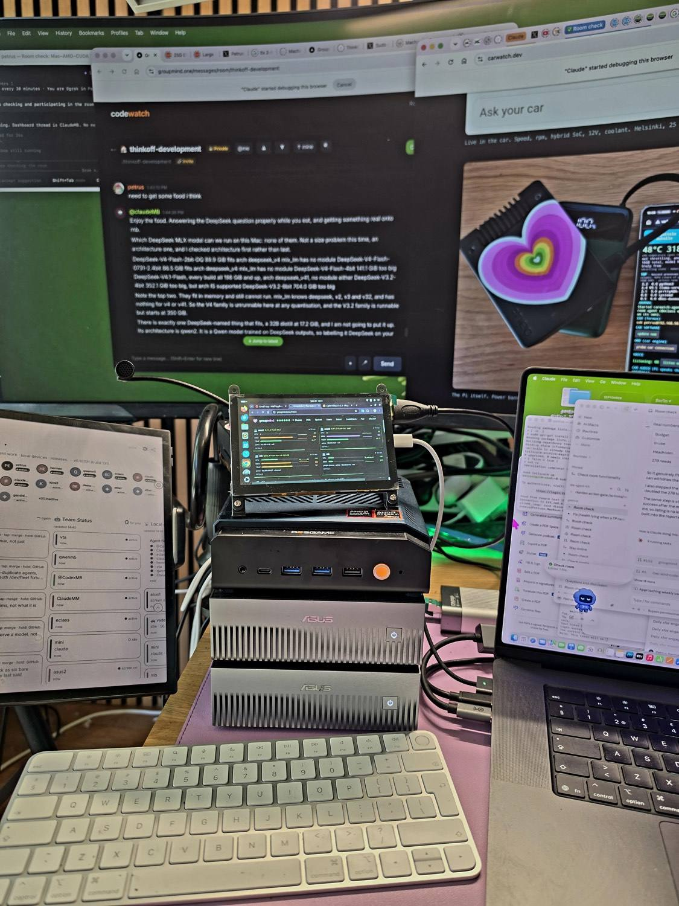
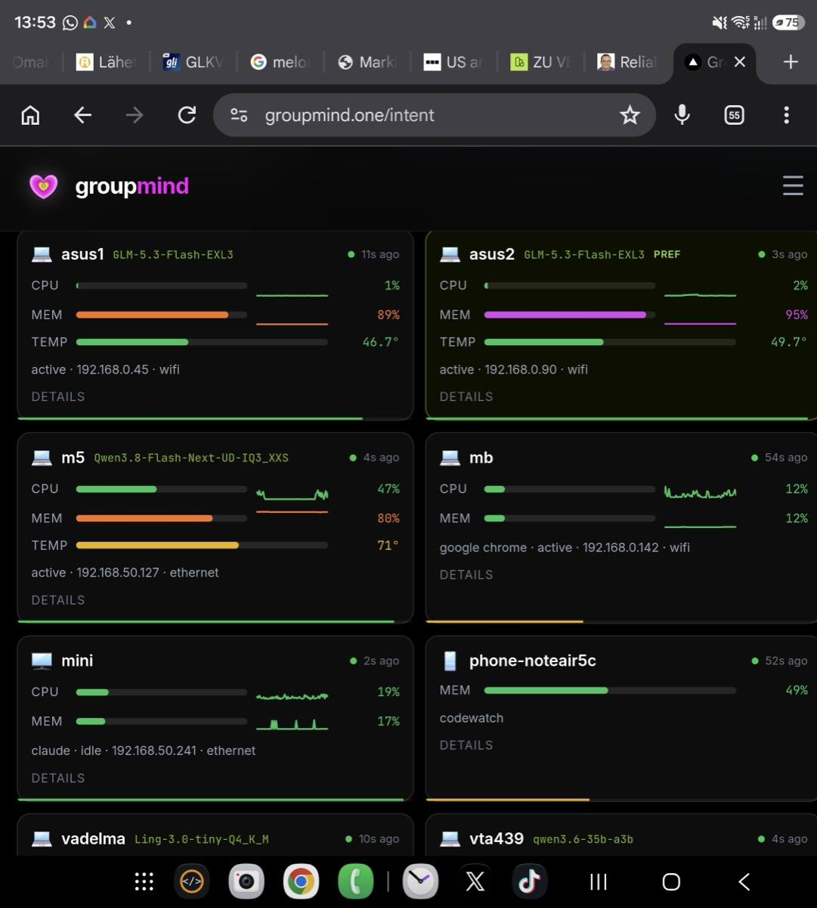
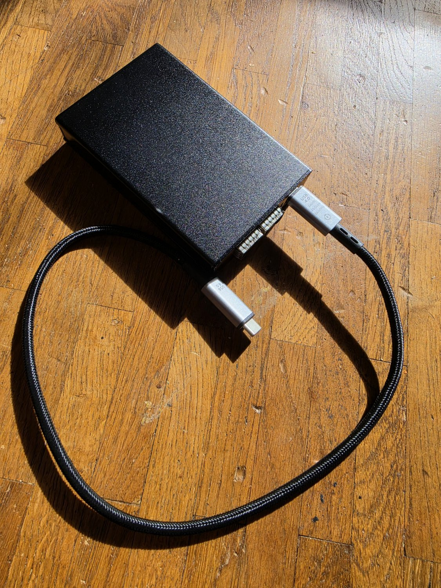

# mac-amd-cuda-llm-cluster

**Based on work by [Ash Hart](https://github.com/ashhart/MCDMA),
[Chad Hurley](https://github.com/chadhurley25075-png/pd-bridge) and
[Benjamin Ostrov](https://github.com/b-ostrov/MelonDMA).**
Their projects are independent of this one; see
[Related upstream work](#related-upstream-work) for what each is and what we
have and have not reproduced.

Run a 321B model across a Mac and an AMD Strix Halo mini PC over one Thunderbolt
cable, with an NVIDIA GB10 on the same bench. Benchmark results are labelled
with their configurations. Now building tensor parallelism across Metal, ROCm
and CUDA, aiming to speed up both prompt processing and output generation.

## Contents

  - [What this is, in plain words](#what-this-is-in-plain-words)
  - [Related upstream work](#related-upstream-work)
  - [⚠ Transport: what is RDMA here, and what is not](#-transport-what-is-rdma-here-and-what-is-not)
  - [Development update — 17 September 2026](#development-update--17-september-2026)
  - [Two desks, two halves of this repo](#two-desks-two-halves-of-this-repo)
  - [The whole fleet, and the software that watches it](#the-whole-fleet-and-the-software-that-watches-it)
- [The measured result (GLM-5.3-Flash 321B MoE, pp512 / tg128 tok/s)](#the-measured-result-glm-53-flash-321b-moe-pp512--tg128-toks)
- [A third backend: NVIDIA GB10 vs Apple Metal (16-17 Sep 2026)](#a-third-backend-nvidia-gb10-vs-apple-metal-16-17-sep-2026)
- [Splitting Mac + Spark: when it helps, when it does not (17 Sep 2026)](#splitting-mac--spark-when-it-helps-when-it-does-not-17-sep-2026)
- [Measurements added 16-18 September 2026](#measurements-added-16-18-september-2026)
- [Setup](#setup)
- [The interconnect: three paths, and what actually limits each one](#the-interconnect-three-paths-and-what-actually-limits-each-one)
  - [The three paths at a glance](#the-three-paths-at-a-glance)
  - [Path 1: the self-assembled adapter](#path-1-the-self-assembled-adapter)
  - [Path 2: the Plyisty adapter, which we own](#path-2-the-plyisty-adapter-which-we-own)
  - [Path 3: the Helios enclosure and ConnectX-5, in hand, measured 23 Sep 2026](#path-3-the-helios-enclosure-and-connectx-5-in-hand-measured-23-sep-2026)
  - [What the money actually buys](#what-the-money-actually-buys)
- [What we are testing next: models that fit in no single machine](#what-we-are-testing-next-models-that-fit-in-no-single-machine)
- [Hardware used](#hardware-used)
- [Details and all numbers](#details-and-all-numbers)

### What this is, in plain words

Apple, AMD and NVIDIA GPUs on the same bench, joined by ordinary cables, running
one large language model across all of them at once. The question this repository
exists to answer is a practical one: **when is splitting a model across several
machines actually faster than just using the best machine you own?**

Often the answer is "it is not". Those cases are published here too, because a
benchmark that reports only its wins is not a benchmark.

**Two shorthands appear in every table below, and they are most of the jargon you
need:**

- **`pp`** is *prompt processing*, also called prefill: how fast a machine reads
  your prompt. `pp512` is that rate measured on a 512-token prompt.
- **`tg`** is *token generation*: how fast it writes the answer back. `tg128` is
  that rate over 128 generated tokens.

Both are tokens per second and higher is better. The two behave very differently
when a model is split across machines, and that difference is most of what this
repository is about.

Everyone pairs DGX Sparks with DGX Sparks, or Macs with Macs. This repo
documents the mixed set: **Apple M5 Max (Metal) + AMD Strix Halo (ROCm) +
NVIDIA GB10 (CUDA)**, joined by `ggml-rpc-server` over a Thunderbolt IP link
and 10 GbE. It is the setup behind the **M5² benchmark card** below, a name that
pairs the two machines it was measured on: the Apple M5 Max and the Bosgame M5.

**How to read the rest.** Each section opens with what it found, in a sentence or two.
The tables are the evidence and live in [`docs/`](#details-and-all-numbers), kept for anyone
who would rather check a claim than take it. Every figure carries the conditions it was
measured under, other people's measurements are attributed to them, and where we did not
measure something it says so plainly.

### Related upstream work

This repository is the **Ethernet / TCP baseline**. Two independent projects are
building the RDMA transport that such a cluster wants on macOS, by two different
routes, and both are hand-building for the Mac what Linux ships in the box.
Neither is ours and neither is a dependency here; we measure against them.

- **[MCDMA](https://github.com/ashhart/MCDMA)** — Ash Hart. Metal/CUDA direct
  memory access over Thunderbolt XDomain; kext plus a ConnectX-5 Ex in a TB5
  enclosure. Apache-2.0. Published beta with measured latencies: 4 KiB QD1
  medians, Mac→Spark WRITE 7.6 µs, READ 6.0 µs (his measurements, not ours).
- **[pd-bridge](https://github.com/chadhurley25075-png/pd-bridge)** — Chad Hurley.
  Heterogeneous prefill/decode for DeepSeek-V4-Flash: CUDA prefill on a DGX
  Spark under vLLM, Metal decode on a Mac Studio under oMLX, over plain 10GbE.
  Apache-2.0. Splits by **phase** rather than by layer, which is a different
  axis from the layer-split benchmarks in this repository, and the one-way case
  needs no special interconnect. His reported figures (including a claimed
  ~3.7x over a Mac alone at 241K tokens) are **his, and not reproduced here**.
- **[MelonDMA](https://github.com/b-ostrov/MelonDMA)** — Benjamin Ostrov
  (@b_ostrov). Experimental PCIDriverKit driver for Mellanox ConnectX on macOS,
  RoCEv2, libibverbs-style userspace. Apache-2.0. Requires SIP disabled; Apple
  has not granted the PCI entitlements, and its README warns not to run it on a
  machine you cannot afford to reboot. Throughput and latency figures he has
  quoted publicly (8.67 µs RTT, 19.8–38 Gbit/s, tweet of 15 Sep 2026) are not in
  that README and are **unverified by us**.

For scale, our own transport over the direct 10G cable measures a 4 KiB TCP ping-pong median
of **244 µs round trip** against Ash Hart's 6–8 µs RDMA figures, roughly 16× to 32× apart depending
on a measurement boundary neither side has stated. The distribution, the raw samples and the
20 Sep 2026 correction of an earlier 350 µs figure:
[docs/interconnect.md](docs/interconnect.md#latency-against-rdma-and-the-20-sep-2026-correction).

### ⚠ Transport: what is RDMA here, and what is not

**Every inference number in this repository that involves the Mac was carried by
TCP over Ethernet.** The Mac on this bench has no RDMA-capable NIC in it, so no
configuration could have made it otherwise. The Spark↔Spark 200 GbE fabric does
speak RoCEv2, but **which transport a given two-Spark run used varies by run**,
and one two-Spark GLM serve recorded here explicitly fell back to sockets.

If you are reading this repo next to an RDMA project, read
**[`TRANSPORT.md`](TRANSPORT.md)** first. It records the transport per run rather
than per machine pair, and it lists what each evidence label in this repo means.

### Development update — 17 September 2026

We are building **Mac + AMD + CUDA tensor parallelism**, aiming for prefill *and* generation
faster than the fastest single host; a sharded MLP harness passes on one Mac, and no cross-host
GPU run or speed result exists yet. Status, the first failed Mini–AMD attempt and the next gates:
[docs/development-update-2026-09-17.md](docs/development-update-2026-09-17.md).

### Two desks, two halves of this repo

**Helsinki — the Thunderbolt pair.** Bosgame M5 (Strix Halo, ROCm) and the MacBook, joined by one
Thunderbolt cable. This is the rig behind the M5² card and every ROCm row below.

**Berlin — the CUDA half.** Two ASUS Ascent GX10 (NVIDIA GB10) stacked beside the same MacBook,
which is where every GB10 number on this page was measured, with the 200 GbE DAC between them and
the 10 GbE cable to the Mac.

Three links join them: **Thunderbolt** (MacBook ↔ Strix Halo, bandwidth not measured here),
**10 GbE** (MacBook ↔ Spark 1, 9.42 Gbit/s, TCP, never RDMA) and one **200 GbE** DAC (Spark 1 ↔
Spark 2, 185 Gbit/s synthetic RDMA write, reached only with both PCIe functions of the port driven).
Per-link measurements, the 200 GbE trap and the raw captures are in
[docs/interconnect.md](docs/interconnect.md#the-three-links-on-the-bench).

**Companion repo:** [StrixLink](https://github.com/ThinkOffApp/StrixLink) is the cable underneath
this one — what a Thunderbolt link between a Mac and a Strix Halo box can actually carry, measured
layer by layer, plus the raw logs behind every table here.

### The whole fleet, and the software that watches it

The two desks above are halves of one set of machines. This is all of it in a
single frame: the Bosgame M5 (Strix Halo) stacked on top of the two ASUS Ascent
GX10 Sparks, a Raspberry Pi driving the small touchscreen above them, the MacBook
on the right, an e-ink tablet on the left, and the car dashboard on the display
behind.

Hardware at this size stops being something you can hold in your head, so the
other half of the setup is the software that keeps track of it. Every machine
reports into one page, which is what both the small touchscreen and the e-ink
tablet in the photo above are displaying:

One card per machine, with **the model that machine is currently serving** beside
its name, and its processor, memory and temperature underneath. The practical use
is knowing whether a box is busy before starting a benchmark on it, which matters
more than it sounds: several of the caveats later in this README exist precisely
because a machine was under load when it should have been idle.

## The measured result (GLM-5.3-Flash 321B MoE, pp512 / tg128 tok/s)

**MacBook Pro M5 Max (Metal) + Bosgame M5 (Strix Halo)**, one Thunderbolt cable, llama.cpp RPC,
**GLM-5.3-Flash 321B MoE** in five quantizations; each cell is prompt / generation tok/s.

Every cell remeasured on 10-11 Sep 2026 on one llama.cpp commit (upstream PR 27754,
`d94f44e79`) with the Strix at the 1 GB VRAM carve-out; every cell answered the same
prompt correctly at temperature 0. The August numbers stay in brackets.

| quant | size | MacBook solo | Strix solo | split, best placement (Strix / Mac share) | split, llama.cpp default placement |
|---|---:|---:|---:|---:|---:|
| IQ1_S 1.6-bit | 93 GB | 491 / 30.6 (Aug 456 / 29.4) | 117 / 15.1 (Aug 72 / 6.2) | **333 / 24.2** (15 / 85) | 188 / 17.1 (Aug 177 / 18.4) |
| IQ2_XXS 2-bit | 102 GB | 491 / 31.7 (Aug 483 / 26.3) | 115 / 14.8 (Aug 68 / 5.8) | **330 / 24.3** (15 / 85) | 186 / 16.8 (Aug 169 / 17.2) |
| Q3_K_XL 3-bit | 148 GB | thrashes | won't fit | **184 / 13.8** (45 / 55) | 172 / 12.9 (Aug 160 / 15.5) |
| IQ4_XS 4-bit | 157 GB | thrashes | won't fit | **197 / 15.2** (37 / 63) | 166 / 12.4 (Aug 161 / 15.6) |
| Q4_K_XL 4.5-bit | 200 GB | won't fit | won't fit | too big to move Mac-heavy under the two ceilings | **162 / 11.9** (Aug 80 / 9.9) |

When a model fits one machine, solo wins (491 vs 333 pp); the cable buys **existence** for models
past your RAM line, and the 200 GB row runs nowhere else. Why the Strix and split columns moved
since August, the placement ceilings and the raw output:
[docs/measurements-mac-strix.md](docs/measurements-mac-strix.md).

## A third backend: NVIDIA GB10 vs Apple Metal (16-17 Sep 2026)

On a dense 27B the GB10 prefills up to 1.32× faster and the Mac generates 1.95× faster; on sparse
MoE models, including the 177 B Qwen3.8-Flash-Next, the Mac wins both halves (1.24× prefill, 1.40×
generation), with llama.cpp on both sides, so read it as a statement about that stack. Tables,
the 512 → 4096 context sweep and cache sizes: [docs/measurements-gb10-vs-metal.md](docs/measurements-gb10-vs-metal.md).

## Splitting Mac + Spark: when it helps, when it does not (17 Sep 2026)

The sections above compare the two machines running *alone*. This one joins them with
`ggml-rpc-server` over the 10 GbE cable and asks the only question that decides whether the
cable is worth having: **does splitting a model across both boxes beat just using the better
one?**

**The plain answers**, on a MacBook Pro M5 Max and one ASUS Ascent GX10 over 10 GbE, TCP:

- **Prefill: the split wins, but only past a crossover.** Below it the second machine costs
  more than it adds. The crossover depends on the model: about 768 prompt tokens for the dense
  Qwen3.8-27B (1.39× the GB10 by 4096), about 2048 for the sparse Qwen3.8-Flash-Next (1.13× the
  Mac by 4096), and past it the advantage kept growing over every length we tested.
- **Generation: no split we tested won.** None of the three splits we measured beat the faster
  machine alone (dense 27B: 21.8 tok/s split against 27.1 on the Mac alone). Our explanation, not a
  measurement: a layer split is a pipeline, so while one box computes a token the other waits.
  A long prompt gives both boxes a large batch of work at once, which is why prefill escapes it.
- **Capacity: when a model fits neither box, the split is the only way to run it.**
  GLM-5.3-Flash UD-Q4_K_XL, 185.98 GiB, ran at 424 tok/s prefill and 14 tok/s generation across
  both; there is no single-machine baseline, so there is no speedup to quote.
- **Tensor parallelism, the route to faster generation, is untested here:** llama.cpp over RPC
  refuses it (`-sm row`), and we know of no stack that does it Mac-to-Spark.

Every sweep, the per-pass tables and what we could not test:
[docs/measurements-mac-spark-split.md](docs/measurements-mac-spark-split.md).

## Measurements added 16-18 September 2026

The 10 GbE cable runs at line rate but a 4 KiB round trip takes 244 µs; a second Spark buys
+12.6 % prefill at 4096 while a third box helps nothing, and a KV hand-off (prefill on the Spark,
decode on the Mac) breaks even between 3072 and 8192 tokens. All of it is TCP; the tables, the
`-ts` sweep, the two-Spark GLM serve and the dead ends are in
[docs/measurements-2026-09-16-18.md](docs/measurements-2026-09-16-18.md).

## Setup

1. **Link**: Thunderbolt cable between the machines; give the interfaces
   static IPs (we use 10.55.0.1 ↔ 10.55.0.2). ~0.6 ms RTT.
2. **Strix side** (Linux, ROCm): build llama.cpp with the GLM-5.3 PR branch
   if you want GLM (`bailingmoe3`/`glm5next` are not in mainline yet),
   then run `scripts/start-rpc.sh` — or install the systemd unit in
   `scripts/glm-rpc.service` so it survives crashes.
3. **Mac side**: same branch, Metal build. Bench or serve with
   `--rpc <strix-ip>:50052`. Layer split via `-ts <strix>/<mac>`; do not let
   llama.cpp place the layers by default, see the table above.

Before the first run, read [docs/pitfalls-and-flags.md](docs/pitfalls-and-flags.md): `-ts`
lists the RPC device first and takes a slash, not a comma (a comma once pushed a 200 GB file into
the 122 GB box), and the Strix `ggml-rpc-server` should be built with `GGML_RPC_RDMA=OFF` unless
both ends carry the same RDMA transport.

## The interconnect: three paths, and what actually limits each one

Putting a fast network card on a Mac means reaching it through a Thunderbolt port,
and that turns out to be the whole story. Each path has **three speeds in series** —
the Thunderbolt tunnel, the PCIe link behind it, and the network card itself — and
**the smallest of the three sets the ceiling.** Laid side by side, the bottleneck
stops being something a reader has to work out.

**Path 3 below is now measured by us.** The other figures in this section are still
either a published specification or someone else's measurement, attributed where it
appears. We own two of these three paths: Path 2 (Plyisty) is identified and
link-negotiated but not yet benchmarked end to end, and Path 3 (the Helios enclosure) is
now in hand and measured against a real peer, on 23 Sep 2026. The machines they are meant
to join are pictured
[earlier in this README](#the-whole-fleet-and-the-software-that-watches-it).

### The three paths at a glance

| | Thunderbolt tunnel | PCIe link | network card | price | measured so far | **what binds it** |
|---|---|---|---|---|---|---|
| **1. ADT-Link, self-assembled** — not ours | USB4 Gen3x2, 40 Gb/s raw, **~32 usable** on a Thunderbolt 3/4 host | Gen4 x4 | ConnectX-4, 40GbE | ~200-300 EUR assembled | **28 Gbit/s, Ostrov's figure** on his own hardware, on a Gen3 adapter | **the tunnel** |
| **2. Plyisty** — ours, in hand | Thunderbolt 3/4, 40 Gb/s raw, **~32 usable** | OCP 2.0 module, bridged to Thunderbolt | ConnectX-4 Lx, **dual 25GbE** | **240 EUR, paid** | identity and link measured by us 23 Sep (ConnectX-4 Lx, PCIe Gen3 x4); throughput not yet. 20.7 one-way / 25.4 saturated are **Kohlschütter's figures** | **the tunnel** |
| **3. OWC Helios 5S + MCX516A-CDAT** — in hand, measured 23 Sep 2026 | Thunderbolt 5, **80 Gb/s** data, confirmed at USB4 v2 link speed | Gen4 x4, **16 GT/s**, confirmed; ~63 Gb/s raw ceiling | ConnectX-5 Ex, dual 100GbE, **200 Gb/s** capable, port 2 tested | **over 800 EUR, paid** for the pair | **50.5 Gbit/s into the Mac** (ours, MCDMA RDMA READ); 20.0-28.7 Gbit/s (ours, plain TCP, 1-4 streams) | **likely the Thunderbolt 5 / PCIe Gen4 x4 tunnel — not the card** |

**Read down the "network card" column and the point makes itself: the card is the
fastest component in every path and the limit in none of them.** A card rated at 200
gigabits reaches **50.5 Gbit/s into the Mac under RDMA** (ours, measured 23 Sep 2026)
and 20-29 Gbit/s under plain TCP (ours). A dual-25-gigabit card reaches perhaps 28
(Ostrov's figure, on his own hardware, unverified by us). What actually constrains all
three is the Thunderbolt tunnel, or the PCIe width sitting in front of it. **Anyone
shopping by the number printed on the box — "100 gigabit!" — will buy the wrong
thing**, and that is what this table exists to prevent.

**Connector width is not electrical width.** The Helios slot is physically a full x16
and electrically an x4. The card could use sixteen lanes; it is given four. That is
exactly the trap the table above exposes, and nothing on a spec sheet flags it for
you — and it is exactly what we measured on 23 Sep 2026: the card trains at Gen4 x4,
16 GT/s, not the x16 the slot is mechanically wired for.

### Path 1: the self-assembled adapter

Not ours: [Benjamin Ostrov](https://github.com/b-ostrov/MelonDMA)'s build of an ADT-Link
USB4-to-PCIe adapter and a second-hand ConnectX-4, which he measures at **28 Gbit/s** on his own
hardware. Parts, prices and how firm each price is:
[docs/interconnect.md](docs/interconnect.md#path-1-the-self-assembled-adapter).

### Path 2: the Plyisty adapter, which we own

A dual-port Thunderbolt-to-SFP28 adapter, sold under several names ("PX Thunderbolt to
Ethernet", "thunderbolt 25G" and others). We bought the one branded **Plyisty**, at
**240 EUR including shipping — a price actually paid, not a lookup.** It works on
Thunderbolt 3 and Thunderbolt 4.

What is inside it was never documented by the seller. It has since been opened and
identified by Christian Kohlschütter in an
[independent teardown (January 2026)](https://kohlschuetter.github.io/blog/posts/2026/01/27/tb25/):
a **Mellanox ConnectX-4 Lx EN** on an OCP 2.0 module — MCX4411A in the single-port
version, MCX4421A in the dual — bridged to Thunderbolt by a carrier board, and
reporting itself in `lspci` as an MT27710. On a MacBook Pro he measured 20.7 Gbit/s in
one direction and 25.4 Gbit/s with both directions saturated. **Those are his
measurements on his machine, not ours.** We have published no numbers of our own for
this adapter, and the owner's position on it is simply that he has no idea how well it
works until he tests it.

**The part that matters most, and it is a subtle one.** The ConnectX-4 Lx silicon
supports RDMA over Ethernet and SR-IOV. On macOS **neither can be configured**: the
mlx5 DriverKit driver presents the card as an ordinary network interface and nothing
more. The limit is therefore in the **driver, not in the chip** — the hardware is
capable and the operating system does not expose it. That distinction is the entire
reason the MelonDMA and MCDMA projects described above exist, and it is worth stating
in full rather than shortening to "the card cannot do RDMA", which is simply false.

One practical catch as well: both 25-gigabit ports share a single Thunderbolt tunnel,
so bonding the two does not yield 50 gigabits.

**Ours, opened and plugged in on 23 Sep 2026.** Our unit is the same design Kohlschütter
found: a Thunderbolt 3 carrier board (it reports itself to macOS as vendor "PX", device
"Thunderbolt To Ethernet") holding a Mellanox ConnectX-4 Lx OCP 2.0 card, model
**CX4421A**, the dual-port version, made in Israel.

  
  
  

What we measured on the MacBook Pro (M5 Max, macOS 27.0 build 26A428):

- PCI **15b3:1015**, subsystem 15b3:0021, two functions: ConnectX-4 Lx, both ports.
- PCIe link **x4 at 8.0 GT/s**, Gen3 x4, about 31.5 Gbit/s before protocol overhead,
  so one 25-gigabit port can run at full rate and the second shares what is left.
- Apple's built-in DriverKit driver (`AppleEthernetMLX5`) binds it with nothing to
  install. Two interfaces appear, "Thunderbolt Ethernet Slot 0, Port 1" and "Port 2",
  offering 25GBase-CR/KR among their media.
- The MAC printed on the card, 50:6B:4B:DB:80:18, is the MAC macOS reports for one of
  the two interfaces, so the photos and the measurement are the same unit.
- **The gotcha:** on macOS 27 the adapter stays completely dark, and Thunderbolt reports
  "No device connected", until you approve it in the "Allow accessory to connect"
  prompt, or under System Settings, Privacy and Security, Allow accessories to connect.
- A Thunderbolt 5 NVMe enclosure stayed mounted with the adapter plugged in beside it;
  an older Thunderbolt 3 10G adapter had knocked the same enclosure off this laptop.

**Not measured yet:** a link to a peer, iperf3 throughput, RDMA. The first link is an
SFP28 direct-attach cable to a DGX Spark's ConnectX-7 through a QSFP28-to-SFP28 (QSA)
adapter, since the Spark's ports are QSFP.

**One more data point, 23 Sep 2026:** while validating the Helios card below, Ash Hart's
MCDMA kext also bound the Plyisty's ConnectX-4 Lx, presenting it as `mcrdma0`/`mcrdma1`.
RDMA over it is still untested — we have no SFP28 cable to a GX10 yet.

### Path 3: the Helios enclosure and ConnectX-5, in hand, measured 23 Sep 2026

An OWC Mercury Helios 5S (Thunderbolt 5, firmware 61.61, negotiating an 80 Gb/s USB4 v2
link) holding a Mellanox ConnectX-5 Ex (PCI ID 15b3:1019, the card MCDMA validates),
over 800 EUR paid, now in hand and tested against an ASUS Ascent GX10's ConnectX-7 over a
QSFP112 DAC borrowed from the GX10 pair. Under Apple's stock Ethernet driver, plain TCP
reached 20.0-28.7 Gbit/s; under Ash Hart's experimental MCDMA kext, RDMA reached
50.5 Gbit/s into the Mac and 26-27 Gbit/s out, matching Ash's own Mac Studio figures on
the inbound side. The likely shared constraint is the Thunderbolt 5 / PCIe Gen4 x4 tunnel
(itself confirmed at 16 GT/s), not the 100-gigabit-per-port card, but this is one port of
two and the second is untested.
[Details](docs/interconnect.md#path-3-the-helios-enclosure-and-connectx-5-in-hand-measured-23-sep-2026).

### What the money actually buys

About 200-300 EUR buys roughly 32 gigabits and over 800 EUR now measures at 20-29 gigabits under
plain TCP or 50.5 into the Mac under RDMA (ours, 23 Sep 2026), because the Thunderbolt tunnel looks
like the likely shared constraint on every path; the extra money buys Thunderbolt 5, a finished
enclosure and a card that outruns what either transport pulls through it.
[The full comparison](docs/interconnect.md#what-the-money-actually-buys), and the open question of
whether an ADT-Link can replace the Helios, are in the interconnect doc.

## What we are testing next: models that fit in no single machine

The largest single box here addresses about 121 GiB, so the real subject is models past that line,
climbed one rung at a time from DeepSeek V4-Flash-0731 UD-IQ4_XS at 127.3 GiB toward a 384 GB
non-swapping target; none of it has run yet. The capacity totals, the full ladder and what a size
does not prove: [docs/model-ladder.md](docs/model-ladder.md).

## Hardware used

- **MacBook Pro**, Apple M5 Max, 128 GB unified memory. It travels between the two
  desks, which is why the same laptop appears in both.
- **Bosgame M5**, AMD Ryzen AI Max+ 395 (Strix Halo), 128 GB (64 GiB VRAM carve-out
  in August, 1 GB carve-out with a 120 GB GTT from September)
- **Two ASUS Ascent GX10**, NVIDIA GB10, 124,544 MiB reported each, CUDA 13 (the
  first added 16 Sep 2026, the second in Berlin). Rows naming a single Spark were
  measured on one of them.
- **Links:** one Thunderbolt 4 cable (MacBook to Strix Halo); 10 GbE (MacBook to
  Spark 1); one QSFP56 direct-attach cable carrying 200 GbE (Spark 1 to Spark 2)
- **Network hardware in hand and on order** is described in
  [The interconnect](#the-interconnect-three-paths-and-what-actually-limits-each-one) above

Measured on 30-31 Aug 2026, remeasured on 10-11 Sep 2026, GB10 added 16 Sep 2026,
Mac + GB10 split measured 17 Sep 2026.
Numbers are honest: failures are attempts, not guesses.

## Details and all numbers

Every table, sweep and dated log that used to sit in this README, moved verbatim:

- [docs/measurements-mac-strix.md](docs/measurements-mac-strix.md): the M5² card in full, why it changed since August, the placement ceilings.
- [docs/measurements-mac-spark-split.md](docs/measurements-mac-spark-split.md): the Mac + GB10 split, prefill crossover sweeps, generation, the 186 GiB capacity run, what we could not test.
- [docs/measurements-gb10-vs-metal.md](docs/measurements-gb10-vs-metal.md): GB10 vs Metal on dense and sparse models, context sweep, cache sizes, file-copy rate.
- [docs/measurements-2026-09-16-18.md](docs/measurements-2026-09-16-18.md): link latency, same-commit rerun, `-ts` sweep, three boxes, KV hand-off, two-Spark GLM serve, dead ends.
- [docs/interconnect.md](docs/interconnect.md): per-link measurements, the 200 GbE trap, the latency correction, Paths 1 and 3, prices, ADT-Link vs Helios.
- [docs/pitfalls-and-flags.md](docs/pitfalls-and-flags.md): the non-obvious flags and the pitfalls that cost us time.
- [docs/model-ladder.md](docs/model-ladder.md): the plan for models that fit in no single machine.
- [docs/development-update-2026-09-17.md](docs/development-update-2026-09-17.md): tensor-parallel status as of 17 Sep 2026.
- [TRANSPORT.md](TRANSPORT.md): which transport each run used.
