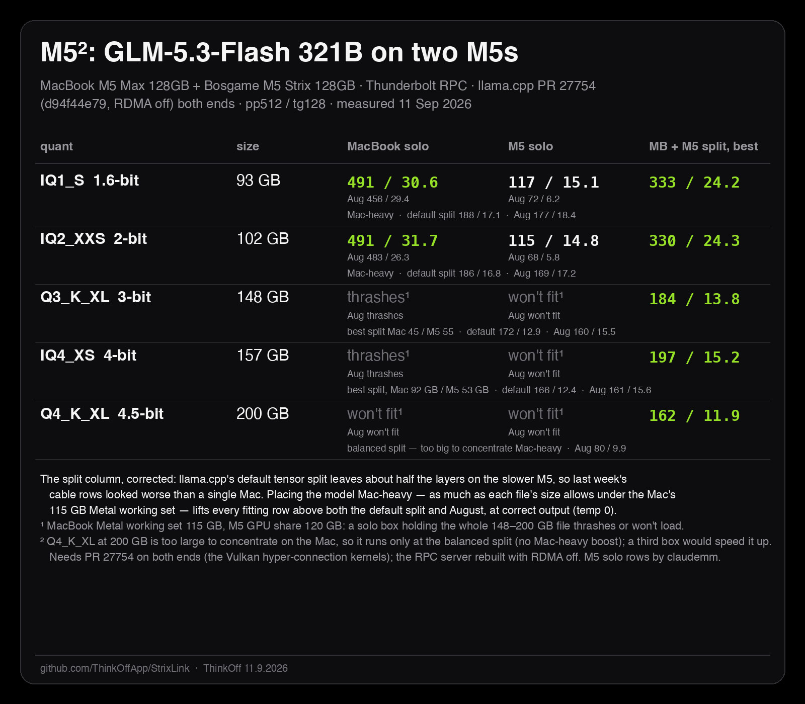

# mac-amd-cuda-llm-cluster

Run a 321-billion-parameter language model across a MacBook and an AMD Strix
Halo mini-PC with llama.cpp's built-in RPC — one Thunderbolt cable, no cloud,
every number measured.

Everyone pairs DGX Sparks with DGX Sparks, or Macs with Macs. This repo
documents the mixed set: **Apple M5 Max (Metal) + AMD Strix Halo (ROCm) +
NVIDIA GB10 (CUDA)**, joined by `ggml-rpc-server` over a Thunderbolt IP link
and 10 GbE. It is the setup behind the M5² benchmark card.

All three backends now appear here, which is why the repo is no longer called
`mac-amd-llm-cluster`. The GB10 section below is a straight two-way comparison
on identical files; it is not yet wired into the RPC split.

**Companion repo:** [StrixLink](https://github.com/ThinkOffApp/StrixLink) is the cable underneath
this one — what a Thunderbolt link between a Mac and a Strix Halo box can actually carry, measured
layer by layer, plus the raw logs behind every table here.

## The measured result (GLM-5.3-Flash 321B MoE, pp512 / tg128 tok/s)

Every cell remeasured on 10-11 Sep 2026 on one llama.cpp commit (upstream PR 27754,
`d94f44e79`) with the Strix at the 1 GB VRAM carve-out; every cell answered the same
prompt correctly at temperature 0. The August numbers stay in brackets.

| quant | size | MacBook solo | Strix solo | split, best placement (Strix / Mac share) | split, llama.cpp default placement |
|---|---:|---:|---:|---:|---:|
| IQ1_S 1.6-bit | 93 GB | 491 / 30.6 (Aug 456 / 29.4) | 117 / 15.1 (Aug 72 / 6.2) | **333 / 24.2** (15 / 85) | 188 / 17.1 (Aug 177 / 18.4) |
| IQ2_XXS 2-bit | 102 GB | 491 / 31.7 (Aug 483 / 26.3) | 115 / 14.8 (Aug 68 / 5.8) | **330 / 24.3** (15 / 85) | 186 / 16.8 (Aug 169 / 17.2) |
| Q3_K_XL 3-bit | 148 GB | thrashes | won't fit | **184 / 13.8** (45 / 55) | 172 / 12.9 (Aug 160 / 15.5) |
| IQ4_XS 4-bit | 157 GB | thrashes | won't fit | **197 / 15.2** (37 / 63) | 166 / 12.4 (Aug 161 / 15.6) |
| Q4_K_XL 4.5-bit | 200 GB | won't fit | won't fit | too big to move Mac-heavy under the two ceilings | **162 / 11.9** (Aug 80 / 9.9) |

**What the rerun found.** Two things moved, neither of them hardware.

1. *The Strix solo column was the code, not the memory.* August's own binary gives the
   same ~8.7 tok/s at either carve-out; the 3 September GLM branch gives 12.2, and PR
   27754's Vulkan kernels for the fused hyper-connection ops give 15.1. The BIOS change
   (64 GB carve to 1 GB, one contiguous ~120 GB GPU region) is what lets the 93-102 GB
   files sit on the GPU at all; the speed came from upstream.
2. *The split column was placement.* llama.cpp's default tensor split hands about half the
   layers to the slower box, so the pair was barely faster than August. Putting 85 % of the
   two small files on the Mac (`-ts 15/85`, the RPC device's share comes first) nearly
   doubled prompt speed and lifted generation by a third, on the same two boxes and cable.
   The big files sit where the two ceilings allow: about 110 GB usable on the Strix GPU
   (the 122 GB box hard-hangs above that), about 90 GB of weights on the Mac's Metal
   before it answers "Insufficient Memory" (`iogpu.wired_limit_mb` at its default). Q4_K_XL
   at 200 GB cannot be concentrated on either side, so it keeps the default placement.

The split is still not free speed: when a model fits one machine, solo wins (491 vs 333 pp).
The cable buys **existence** for models past your RAM line: the 200 GB row runs nowhere else.
Raw llama-bench output, the buffer-size lines and the two rows we do not publish (an
M5-heavy slip and the Mac-OOM void) are in
[ThinkOffApp/StrixLink docs/raw-2026-09-11](https://github.com/ThinkOffApp/StrixLink/tree/main/docs/raw-2026-09-11).

The August card, for the record: [benchmarks/m5squared-card.png](benchmarks/m5squared-card.png).

## A third backend: NVIDIA GB10 vs Apple Metal (16-17 Sep 2026)

An ASUS Ascent GX10 (**NVIDIA GB10**, compute capability 12.1, 124,544 MiB, CUDA 13)
joined the bench over 10 GbE. The same GGUF file was copied to both machines and run with the same `llama-bench` flags,
so there are no quant or model differences between the columns. Two things do still differ
besides the silicon: the backend (Metal vs CUDA) and the llama.cpp build, which is six days
apart (Mac `1d0c76f3c`, GB10 `434ddbbc0`, same ggml 0.23.0). Read the columns as
"this file on this machine's stack", not as a pure silicon comparison.

**Dense — Qwen3.8-27B UD-Q4_K_XL, 16.34 GiB, 27.32 B params**

| test | Mac M5 Max (Metal) | GB10 (CUDA) | winner |
|---|---:|---:|---|
| pp512 | 715.06 | **849.32** | GB10 ×1.19 |
| pp2048 | 648.40 | **858.37** | GB10 ×1.32 |
| tg64 | **25.10** | 12.84 | Mac ×1.95 |

**Sparse — Qwen3.6-35B-A3B UD-Q3_K_S, 14.29 GiB, 34.66 B total / 3 B active**

| test | Mac M5 Max (Metal) | GB10 (CUDA) | winner |
|---|---:|---:|---|
| pp512 | **3240.20** | 2439.58 | Mac ×1.33 |
| pp2048 | **3080.27** | 2455.70 | Mac ×1.25 |
| tg64 | **97.67** | 68.37 | Mac ×1.43 |

**On these two models, the GB10's prefill lead appears on the dense one and reverses on the
sparse one.** On the dense 27B the GB10 prefills 1.32× faster while the Mac generates nearly
twice as fast — the familiar compute-versus-bandwidth split, and the reason a prefill-there /
generate-here arrangement looks attractive. On the sparse 35B-A3B, a *larger* model by total
parameters, the Mac wins both halves.

Two configurations are not a law. What we have is one dense pair and one sparse pair, on one
quant each, on two llama.cpp builds. The obvious *hypothesis* is that with 3 B of 34.66 B
parameters active, prefill stops being dominated by dense matmul and becomes routing and
gather work, which would favour unified memory — but nothing here measures that mechanism,
and we have not varied sparsity, quant or build independently.

Why it still matters for this repo: the models we are aiming at in the 100 GB class are all
MoE — GLM-5.3-Flash, DeepSeek V4.1, Qwen3.8-Flash-Next (512 experts, 10 active). If the
reversal holds for them, the GB10 is the slower box at both halves for exactly the workloads
this repo exists to run. That is the next measurement, not a conclusion.

*The control we have not run:* whether the reversal is the silicon or llama.cpp's CUDA MoE
path being less mature than its Metal one. The separator is the same model on a native NVIDIA
stack (TensorRT-LLM or a modelopt-aware vLLM). Until then the sparse table says
"llama.cpp on this hardware", not "this hardware".

**Approximate effective weight-read rate** (weight bytes × tg64 on the dense model):
≈440 GB/s on the M5 Max, ≈225 GB/s on the GB10. This is not measured DRAM bandwidth. It
assumes a decode reads each weight exactly once per token and counts nothing else — no
activations, no KV traffic, no cache hits or repeated reads — so treat it as a floor on
achieved bandwidth and a rough way to compare the two machines, not as a hardware figure.

**Cache sizes, read from llama.cpp's own allocator rather than computed** (Qwen3.8-27B,
`-c 4096`): KV cache 256.00 MiB over 16 full-attention layers = exactly 64 KiB/token, plus a
`llama_memory_recurrent` block of 149.62 MiB that is **fixed in sequence length** (R f32 5.62,
S f32 144.00) across all 64 blocks. The model is 16 full-attention + 48 linear-attention
layers: the 48 linear layers use a fixed-size recurrent state, while total state still grows
with the 16 KV layers. At the `-c 4096` shown, the variable part is already the larger of the
two (256.00 MiB KV against 149.62 MiB recurrent); they cross at roughly 2,400 tokens.

**Link**: a 17,559,178,144-byte model file copied Mac → GB10 over 10 GbE in 15 s =
1.171 GB/s (1116 MiB/s) = **9.36 Gbit/s**; a 15.36 GB file measured 8.77 Gbit/s. Plain
`cat | ssh`, no compression. Decimal GB and binary MiB throughout, which is worth stating
because mixing them turns the same measurement into 8.93 Gbit/s.

## The non-obvious flags

- `ggml-rpc-server` started plain offers only the GPU. At the factory 64 GB carve-out,
  **`-d ROCm0,CPU`** made it offer both devices (~125 GiB instead of 64), which is how the
  200 GB model first fitted on two boxes in August. At the 1 GB carve-out the Vulkan device
  alone offers ~119 GiB and the CPU device is no longer worth routing through (it halved
  prompt speed in our Q3 tests).
- **`-ts` lists the RPC device first.** `-ts 15/85` means 15 % on the Strix, 85 % on the Mac.
  A comma (`-ts 15,85`) is a list of separate runs, not a ratio, and pushed a 200 GB file whole
  into the 122 GB box (a 2-hour hard hang). Use the slash, and size-check the RPC share before
  every run (`scripts` in StrixLink carry a guard).
- The default placement is the slow one: see the table. Put the layers where the bandwidth is.
- Build the Strix `ggml-rpc-server` with **`GGML_RPC_RDMA=OFF`** unless both ends carry the same
  RDMA transport; a mismatch aborts every split load mid-way with no useful message.
- The server's `-c` file cache makes warm restarts ~64x faster but writes every shard of every
  run to `~/.cache/llama.cpp/rpc` (441 GB after one day of sweeps). Use it, and clear it.

## Setup

1. **Link**: Thunderbolt cable between the machines; give the interfaces
   static IPs (we use 10.55.0.1 ↔ 10.55.0.2). ~0.6 ms RTT.
2. **Strix side** (Linux, ROCm): build llama.cpp with the GLM-5.3 PR branch
   if you want GLM (`bailingmoe3`/`glm5next` are not in mainline yet),
   then run `scripts/start-rpc.sh` — or install the systemd unit in
   `scripts/glm-rpc.service` so it survives crashes.
3. **Mac side**: same branch, Metal build. Bench or serve with
   `--rpc <strix-ip>:50052`. Layer split via `-ts <strix>/<mac>`; do not let
   llama.cpp place the layers by default, see the table above.

## Honest pitfalls (each cost us real time)

- **Metal OOM presents as `res = -3`** with the true cause
  (`kIOGPUCommandBufferCallbackErrorOutOfMemory`) hidden unless you pass
  `-v` — llama-bench's default verbosity filters even error-level log lines
  (upstream issue ggml-org/llama.cpp#28107).
- A model file's NAME is not its contents: unsloth UD-IQ3_XXS ships IQ3_S
  expert tensors and zero IQ3_XXS ones. Read the tensor table before
  reasoning about kernels.
- The RPC server wedges under connect storms; supervise it
  (`Restart=on-failure`) rather than discovering it dead mid-bench.
- Measure the memory ceiling PER PATH: the same box offered us 64 GiB over
  RPC and ran an 82 GB model locally, on the same afternoon.
- A bad split does not fail, it just measures slowly: 92 GB on the Mac gave
  pp 20 with a ±6 error bar and a Metal OOM on the generation test. Read the
  buffer-size lines in the load log before trusting a row.
- A watchdog that says "ssh down" during a split is usually a box at load
  average 20 answering slowly; verify on both addresses before reacting.

## Hardware used

- MacBook Pro, Apple M5 Max, 128 GB unified
- Bosgame M5, AMD Ryzen AI Max+ 395 (Strix Halo), 128 GB (64 GiB VRAM carve in
  August, 1 GB carve with a 120 GB GTT from September)
- ASUS Ascent GX10, NVIDIA GB10, 124,544 MiB, CUDA 13 (added 16 Sep 2026)
- One Thunderbolt 4 cable; 10 GbE to the GX10

Measured on 30-31 Aug 2026, remeasured on 10-11 Sep 2026, GB10 added 16-17 Sep 2026.
Numbers are honest: failures are attempts, not guesses.
